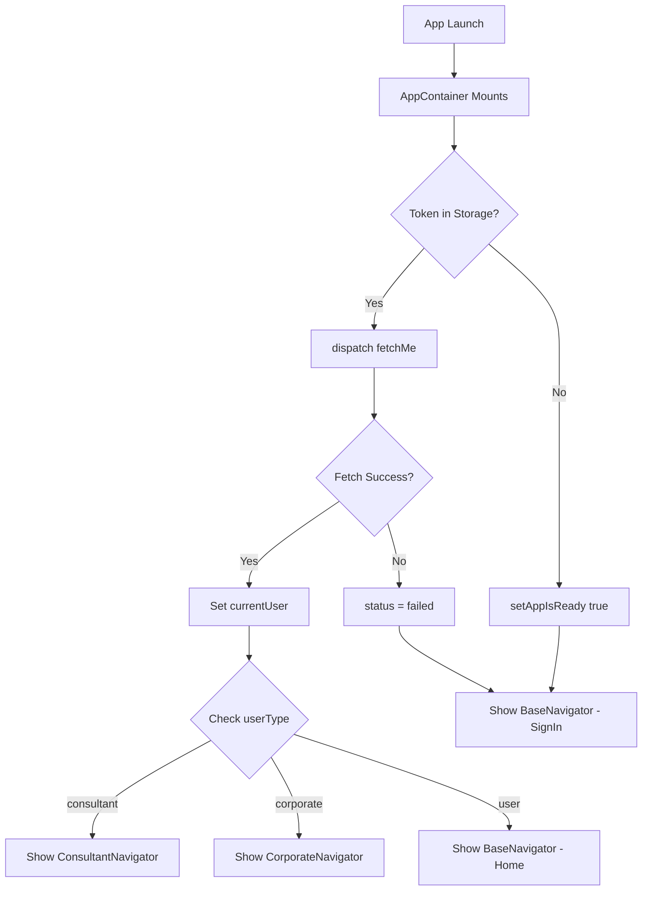

# AppContainer & AppContainerSlice Architecture

## Overview

The `AppContainer` component is the root component of the application that manages navigation between different user types (Base/Unauthenticated, Consultant, and Corporate users). It works in conjunction with `appContainerSlice` to manage global application state, user authentication, and navigation flow.

---

## File Structure

```
consultant_mobile/
├── components/
│   ├── AppContainer.tsx          # Main container component
│   └── appContainerSlice.ts      # Redux slice for app state
├── navigators/
│   ├── BaseNavigator.tsx         # Navigator for unauthenticated users
│   ├── ConsultantNavigator.tsx   # Navigator for consultant users
│   └── CorporateNavigator.tsx    # Navigator for corporate users
├── navigations-maps/
│   ├── Base.tsx                  # Route definitions for base flow
│   ├── Consultant.tsx            # Route definitions for consultants
│   └── Corporate.tsx             # Route definitions for corporate users
└── screens/
    ├── consultant-home/
    │   └── ConsultantHome.tsx    # Consultant dashboard
    └── corporate-home/
        └── CorporateHome.tsx     # Corporate dashboard
```

---

## AppContainer Component

### Location
`consultant_mobile/components/AppContainer.tsx`

### Purpose
- Root component that wraps the entire navigation structure
- Manages authentication state and user session
- Determines which navigator to show based on user type
- Handles app initialization and splash screen

### Key Features

#### 1. **Authentication State Management**
```tsx
const currentUser = useAppSelector(selectCurrentUser);
const status = useAppSelector(selectStatus);
const isAppReady = useAppSelector(selectIsAppReady);
```

#### 2. **Token Retrieval on App Launch**
```tsx
const retrieveTokenFromStorageIfAny = useCallback(async () => {
  const token = await retriveData(KeyForStorage.accessToken);
  
  if (token) {
    dispatch(fetchMe()); // Fetch user data if token exists
  } else {
    dispatch(setAppIsReady(true)); // Show login screen
  }
}, [dispatch]);
```

#### 3. **Push Notification Token Management**
```tsx
useEffect(() => {
  const persistDeviceToken = async () => {
    const fcmToken = ""; // Get from push notification service
    
    if (fcmToken && currentUser) {
      dispatch(persistFcmTokenAction({
        fcmToken,
        deviceType: Platform.OS,
      }));
    }
  };
  
  persistDeviceToken();
}, [currentUser, dispatch]);
```

#### 4. **Conditional Navigator Rendering**
```tsx
<NavigationContainer>
  {/* Unauthenticated or failed state */}
  {["idle", "failed"].includes(status) && !currentUser && (
    <BaseNavigator initialRouteName={BaseRouteNames.SignIn} />
  )}
  
  {/* Consultant users */}
  {currentUser?.userType === UserType.consultant && (
    <ConsultantNavigator initialRouteName={ConsultantRouteNames.ConsultantHome} />
  )}
  
  {/* Corporate users */}
  {currentUser?.userType === UserType.corporate && (
    <CorporateNavigator initialRouteName={CorporateRouteNames.CorporateHome} />
  )}
  
  {/* Regular/default users */}
  {currentUser?.userType === UserType.user && (
    <BaseNavigator initialRouteName={BaseRouteNames.Home} />
  )}
</NavigationContainer>
```

### Component Lifecycle



---

## AppContainerSlice

### Location
`consultant_mobile/components/appContainerSlice.ts`

### Purpose
Redux slice that manages global application state, including:
- Current authenticated user
- Authentication status
- App readiness state
- Network connectivity
- User session management

### State Interface

```typescript
export interface appContainerSliceState {
  error: string;                    // Error messages
  status: "idle" | "loading" | "failed"; // Auth status
  currentUser: userInfo | null;     // Current user data
  isAppReady: boolean;              // Splash screen control
  networkIsDown: boolean;           // Network status
}
```

### Initial State

```typescript
const initialState: appContainerSliceState = {
  error: "",
  status: "idle",
  currentUser: null,
  isAppReady: false,
  networkIsDown: false,
};
```

---

## Actions & Reducers

### 1. **logout**
**Type:** Synchronous Reducer

**Purpose:** Clear user session and remove access token

```typescript
logout: create.reducer((state) => {
  removeKey(KeyForStorage.accessToken);
  state.currentUser = null;
  state.status = "idle";
})
```

**Usage:**
```tsx
dispatch(logout());
```

**Effects:**
- Removes `accessToken` from AsyncStorage
- Sets `currentUser` to `null`
- Resets status to `"idle"`
- Triggers re-render showing BaseNavigator with SignIn screen

---

### 2. **setAppIsReady**
**Type:** Synchronous Reducer

**Purpose:** Control splash screen visibility

```typescript
setAppIsReady: create.reducer((state, action: { payload: boolean }) => {
  state.isAppReady = action.payload;
})
```

**Usage:**
```tsx
dispatch(setAppIsReady(true));
```

**When Called:**
- After successful `fetchMe`
- After failed `fetchMe`
- When no token exists on app launch

---

### 3. **setNetworkIsDown**
**Type:** Synchronous Reducer

**Purpose:** Track network connectivity status

```typescript
setNetworkIsDown: create.reducer((state, action: { payload: boolean }) => {
  state.networkIsDown = action.payload;
})
```

**Usage:**
```tsx
dispatch(setNetworkIsDown(true));  // Network error
dispatch(setNetworkIsDown(false)); // Network restored
```

---

### 4. **setCurrentUser**
**Type:** Synchronous Reducer

**Purpose:** Manually set the current user (used after login/signup)

```typescript
setCurrentUser: create.reducer((state, action: { payload: userInfo | null }) => {
  state.currentUser = action.payload;
})
```

**Usage:**
```tsx
dispatch(setCurrentUser(userData));
```

---

### 5. **updateCurrentUser**
**Type:** Synchronous Reducer

**Purpose:** Partially update current user data

```typescript
updateCurrentUser: create.reducer((state, action: { payload: Partial<userInfo> }) => {
  if (state.currentUser) {
    state.currentUser = { ...state.currentUser, ...action.payload };
  }
})
```

**Usage:**
```tsx
dispatch(updateCurrentUser({ 
  firstName: "John",
  emailVerified: true 
}));
```

---

### 6. **fetchMe** (Async Thunk)
**Type:** Asynchronous Action

**Purpose:** Fetch current user data from backend using stored access token

```typescript
fetchMe: create.asyncThunk(
  async () => {
    return await me(); // API call to /users/me
  },
  {
    pending: (state) => {
      state.status = "loading";
    },
    fulfilled: (state, action) => {
      state.status = "idle";
      state.currentUser = action.payload;
      state.isAppReady = true;
    },
    rejected: (state, action) => {
      state.status = "failed";
      state.error = action.error.message || "Failed to fetch user";
      state.isAppReady = true;
      state.currentUser = null;
    },
  }
)
```

**Flow:**
1. **Pending:** Sets status to `"loading"`
2. **Fulfilled:** 
   - Sets `currentUser` with API response
   - Sets status to `"idle"`
   - Sets `isAppReady` to `true`
3. **Rejected:**
   - Sets status to `"failed"`
   - Sets error message
   - Sets `isAppReady` to `true`
   - Clears `currentUser`

**Usage:**
```tsx
dispatch(fetchMe());
```

---

### 7. **persistFcmTokenAction** (Async Thunk)
**Type:** Asynchronous Action

**Purpose:** Send FCM (Firebase Cloud Messaging) token to backend for push notifications

```typescript
persistFcmTokenAction: create.asyncThunk(
  async ({ fcmToken, deviceType }: { fcmToken: string; deviceType: string }) => {
    return await persistFcmToken(fcmToken, deviceType);
  },
  {
    pending: (state) => {
      // Optionally set loading state
    },
    fulfilled: (state, action) => {
      console.log("FCM token persisted successfully");
    },
    rejected: (state, action) => {
      console.log("Failed to persist FCM token", action.error);
    },
  }
)
```

**Usage:**
```tsx
dispatch(persistFcmTokenAction({
  fcmToken: "device_fcm_token_here",
  deviceType: Platform.OS // "ios" or "android"
}));
```

---

## Selectors

### Purpose
Efficiently extract specific parts of state from the Redux store

```typescript
export const {
  selectStatus,           // => "idle" | "loading" | "failed"
  selectError,           // => string
  selectCurrentUser,     // => userInfo | null
  selectIsAppReady,      // => boolean
  selectNetworkIsDown,   // => boolean
} = appContainerSlice.selectors;
```

### Usage in Components

```tsx
import { useAppSelector } from '../hooks/useReduxHooks';
import { selectCurrentUser, selectStatus } from '../components/appContainerSlice';

const MyComponent = () => {
  const currentUser = useAppSelector(selectCurrentUser);
  const status = useAppSelector(selectStatus);
  
  return (
    <View>
      <Text>Status: {status}</Text>
      <Text>User: {currentUser?.email}</Text>
    </View>
  );
};
```

---

## User Flow Examples

### 1. **New User - First Launch**

```
App Launch
    ↓
AppContainer Checks Storage
    ↓
No Token Found
    ↓
setAppIsReady(true)
    ↓
Render BaseNavigator → SignIn Screen
    ↓
User Signs In/Signs Up
    ↓
Save accessToken to AsyncStorage
    ↓
setCurrentUser(userData)
    ↓
Navigate to appropriate dashboard
```

### 2. **Returning User - App Launch**

```
App Launch
    ↓
AppContainer Checks Storage
    ↓
Token Found
    ↓
dispatch(fetchMe())
    ↓
status = "loading"
    ↓
API Call to /users/me
    ↓
Success Response
    ↓
currentUser = userData
status = "idle"
isAppReady = true
    ↓
Check userType
    ↓
├─ consultant → ConsultantNavigator
├─ corporate → CorporateNavigator
└─ user → BaseNavigator (Home)
```

### 3. **User Logout**

```
User Clicks Logout
    ↓
dispatch(logout())
    ↓
Remove accessToken from Storage
    ↓
currentUser = null
status = "idle"
    ↓
Re-render AppContainer
    ↓
Render BaseNavigator → SignIn Screen
```

### 4. **Token Expired/Invalid**

```
App Launch
    ↓
Token Found in Storage
    ↓
dispatch(fetchMe())
    ↓
API Returns 401 Unauthorized
    ↓
Rejected State
    ↓
status = "failed"
currentUser = null
isAppReady = true
    ↓
Render BaseNavigator → SignIn Screen
```

---

## Integration with Sign In/Sign Up

### After Successful Registration

```tsx
// In SignUpSlice.ts - fulfilled state
fulfilled: (state, action) => {
  state.status = "idle";
  state.user = action.payload.user;
  state.accessToken = action.payload.accessToken;
  
  // Save to storage
  saveData(KeyForStorage.accessToken, action.payload.accessToken);
  
  // Update AppContainer state
  dispatch(setCurrentUser(action.payload.user));
  
  // User will now see appropriate navigator based on userType
}
```

### After Successful Sign In

```tsx
// In SignInSlice.ts - fulfilled state
fulfilled: (state, action) => {
  state.status = "idle";
  state.user = action.payload.user;
  state.accessToken = action.payload.accessToken;
  
  // Save to storage
  saveData(KeyForStorage.accessToken, action.payload.accessToken);
  saveUserInfo(action.payload.user);
  
  // Update AppContainer state
  dispatch(setCurrentUser(action.payload.user));
}
```

---

## User Type Routing

### User Types (from models/user.ts)

```typescript
export const UserType = {
  user: 'user',           // Regular/default user
  consultant: 'consultant', // Consultant provider
  corporate: 'corporate',  // Corporate client
  admin: 'admin',         // Admin user
} as const;
```

### Navigation Mapping

| User Type | Navigator | Initial Route |
|-----------|-----------|---------------|
| `null` (not logged in) | `BaseNavigator` | `SignIn` |
| `user` | `BaseNavigator` | `Home` |
| `consultant` | `ConsultantNavigator` | `ConsultantHome` |
| `corporate` | `CorporateNavigator` | `CorporateHome` |

---

## State Management Best Practices

### 1. **Always Use Selectors**
```tsx
// ✅ Good
const user = useAppSelector(selectCurrentUser);

// ❌ Bad
const user = useAppSelector(state => state.appContainer.currentUser);
```

### 2. **Use Type-Safe Hooks**
```tsx
import { useAppDispatch, useAppSelector } from '../hooks/useReduxHooks';

// These hooks are pre-typed with your Redux store
const dispatch = useAppDispatch();
const user = useAppSelector(selectCurrentUser);
```

### 3. **Handle Loading States**
```tsx
const status = useAppSelector(selectStatus);
const isLoading = status === "loading";

return (
  <View>
    {isLoading ? (
      <ActivityIndicator />
    ) : (
      <UserContent />
    )}
  </View>
);
```

### 4. **Handle Error States**
```tsx
const status = useAppSelector(selectStatus);
const error = useAppSelector(selectError);

if (status === "failed") {
  return <ErrorScreen message={error} />;
}
```

---

## API Endpoints Used

### 1. **GET /users/me**
- **File:** `networks/authcalls/me.ts`
- **Purpose:** Fetch current user data using stored access token
- **Called by:** `fetchMe` thunk
- **Headers:** `Authorization: Bearer {token}`

**Response Format:**
```typescript
{
  id: string;
  email: string;
  firstName: string;
  lastName: string;
  userType: 'user' | 'consultant' | 'corporate';
  // ... other user fields based on type
}
```

### 2. **POST /device_infos**
- **File:** `networks/authcalls/me.ts`
- **Purpose:** Register device FCM token for push notifications
- **Called by:** `persistFcmTokenAction` thunk
- **Headers:** `Authorization: Bearer {token}`

**Request Body:**
```typescript
{
  token: string;      // FCM token
  device_type: string; // "ios" or "android"
}
```

---

## Error Handling

### Network Errors
```tsx
const networkIsDown = useAppSelector(selectNetworkIsDown);

if (networkIsDown) {
  return <NetworkError onPressHandler={() => dispatch(setNetworkIsDown(false))} />;
}
```

### Authentication Errors
```tsx
const status = useAppSelector(selectStatus);

useEffect(() => {
  if (status === "failed") {
    // Token expired or invalid
    // User is automatically redirected to SignIn
    Alert.alert("Session Expired", "Please sign in again");
  }
}, [status]);
```

---

## Testing Checklist

### AppContainer Tests
- [ ] Shows BaseNavigator with SignIn when no user
- [ ] Shows ConsultantNavigator for consultant users
- [ ] Shows CorporateNavigator for corporate users
- [ ] Shows BaseNavigator with Home for regular users
- [ ] Fetches user on app launch when token exists
- [ ] Shows SignIn when token is invalid/expired
- [ ] Handles network errors gracefully

### AppContainerSlice Tests
- [ ] `logout` clears user and token
- [ ] `setAppIsReady` controls splash screen
- [ ] `setNetworkIsDown` updates network status
- [ ] `setCurrentUser` updates current user
- [ ] `updateCurrentUser` partially updates user
- [ ] `fetchMe` fetches user data successfully
- [ ] `fetchMe` handles errors correctly
- [ ] `persistFcmTokenAction` sends token to backend

---

## Dependencies

### Required Packages
```json
{
  "@react-navigation/native": "^6.x",
  "@react-navigation/native-stack": "^6.x",
  "@reduxjs/toolkit": "^2.x",
  "react-redux": "^9.x",
  "react-native-gesture-handler": "^2.x",
  "react-native-safe-area-context": "^4.x",
  "@react-native-async-storage/async-storage": "^1.x",
  "expo-status-bar": "^1.x"
}
```

### Related Files
- `store/store.ts` - Redux store configuration
- `store/createAppSlice.ts` - Custom slice creator
- `hooks/useReduxHooks.ts` - Typed Redux hooks
- `utils/storage_utils/storageUtils.ts` - AsyncStorage utilities
- `models/user.ts` - User type definitions
- `networks/authcalls/me.ts` - API calls

---

## Summary

The **AppContainer** and **appContainerSlice** work together to:

1. ✅ Manage global application state
2. ✅ Handle user authentication flow
3. ✅ Route users to appropriate navigators
4. ✅ Persist user sessions across app restarts
5. ✅ Handle push notifications
6. ✅ Manage network connectivity
7. ✅ Control splash screen visibility

This architecture ensures a seamless user experience with proper separation of concerns and maintainable code structure.
